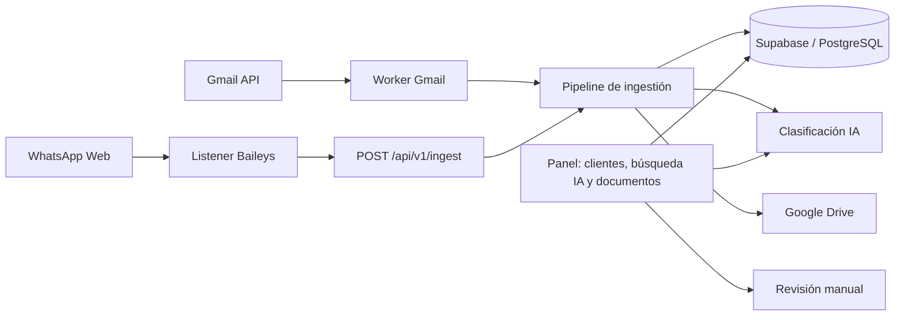

# Arquitectura actual

Aplicación privada con Next.js App Router, TypeScript, Supabase/PostgreSQL, Gmail API, Baileys, Google Drive y un proveedor de IA compatible con OpenAI. Los únicos canales de entrada operativos son Gmail y WhatsApp; la interfaz no expone formularios de ingestión ni datos sintéticos.

## Flujo operativo

- `scripts/sync-gmail.ts` consulta mensajes sin leer, descarga los adjuntos y llama directamente al servicio de ingestión. Al completar un mensaje, lo etiqueta como procesado y lo marca como leído.
- `scripts/whatsapp-listener.ts` conserva la sesión local de Baileys, transforma mensajes entrantes y adjuntos en eventos, y los envía con `INGEST_API_TOKEN` al endpoint interno.
- `src/server/services/ingest.ts` es el pipeline común: valida el evento, resuelve identidades de email/teléfono, registra interacciones/documentos, clasifica y guarda los originales en Drive.
- `.data/staging` conserva los originales durante el procesamiento; se eliminan tras confirmar el guardado en Drive y permanecen disponibles localmente si el evento falla.
- `/` consulta clientes y documentos recientes y procesa `q` con `SearchService`; los resultados se obtienen mediante la RPC parametrizada `search_documents`. Las rutas antiguas `/clients`, `/documents` y `/search` redirigen al panel; los detalles de clientes/documentos y `/review` siguen disponibles.

## Contrato de entrada

`POST /api/v1/ingest` recibe multipart con el evento JSON `schema_version: "1"` y una parte por adjunto declarado. El endpoint solo acepta el token bearer interno del conector; nunca una sesión del navegador. El token no se envía a Gmail ni al navegador.

El contrato admite `source: "gmail" | "whatsapp"`, mensaje con o sin adjuntos, fechas RFC 3339 e IDs externos acotados. Los MIME admitidos son PDF, JPEG, PNG y texto UTF-8; Gmail normaliza `text/markdown` a `text/plain` antes de la validación común. Un adjunto no admitido o texto inválido detiene ese mensaje y evita marcarlo como leído. Se verifican estructura, manifiesto, cantidad, tamaño y MIME detectado desde los bytes. Se normalizan email y teléfono; no se fusionan clientes por nombre. Identidades contradictorias y clasificaciones de baja confianza se envían a revisión.

La RPC `begin_ingestion` registra de forma transaccional la idempotencia del evento, el resultado de resolución de identidad, la interacción y las filas de documentos. La clave idempotente es `(source, source_account_id, external_message_id)`. Un reenvío idéntico devuelve los mismos IDs; el mismo ID con contenido diferente devuelve conflicto.

La verificación operativa del 26 de septiembre de 2026 confirmó un adjunto Markdown de Gmail y una imagen de WhatsApp almacenados en Drive. El evento de WhatsApp quedó asociado a un cliente provisional porque no había un teléfono verificable que coincidiera con el cliente de Gmail; la identidad provisional debe resolverse manualmente si se confirma que son la misma persona.

## Seguridad y datos

- Todas las páginas de trabajo y consultas de negocio requieren sesión de operadora.
- La API de ingesta exige `INGEST_API_TOKEN`; usa HTTPS fuera del entorno local y rota el token si se expone.
- `.env.local`, `.data/` y la sesión `.data/whatsapp-auth/` están ignorados por Git.
- Los binarios originales no se entregan desde `public`; la descarga pasa por una ruta autorizada de documentos.
- Las migraciones son la fuente del esquema; no hay seed de clientes ni cargas sintéticas en el arranque.

## Límites conocidos

Baileys emula WhatsApp Web mediante una librería no oficial: puede romperse o provocar restricciones de cuenta; para producción debe preferirse WhatsApp Business Cloud API. El procesamiento de eventos fallidos no se reintenta automáticamente. La extracción de texto no reemplaza OCR ni análisis antimalware. Las reglas y el proveedor de IA no garantizan identificar contenido ilegible o ambiguo; esos archivos deben revisarse en `/review`.
