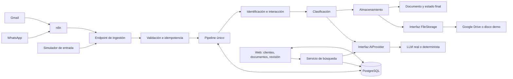
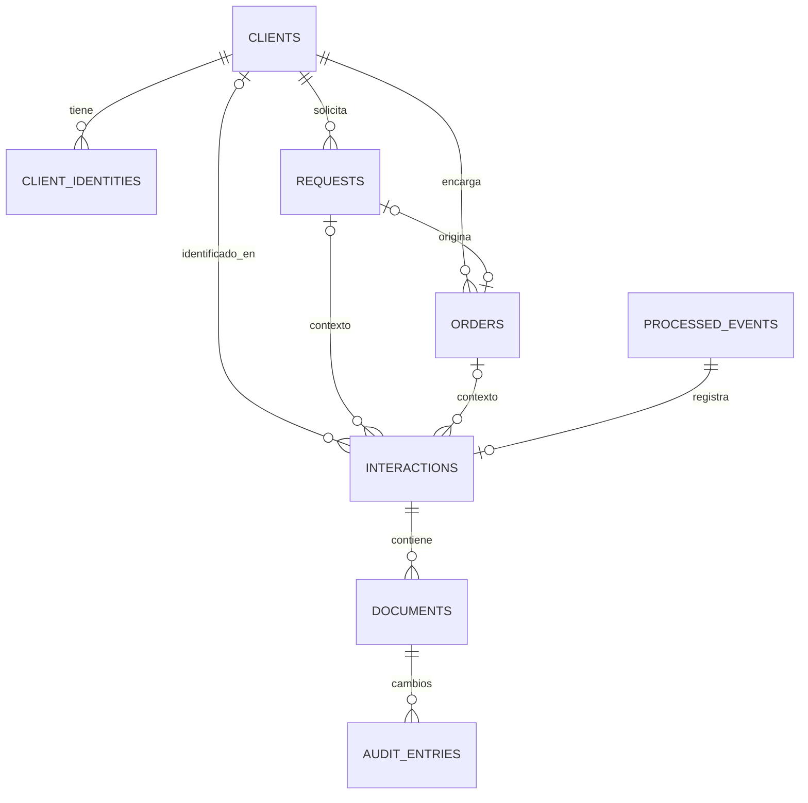

# Arquitectura propuesta del MVP

Estado: arquitectura general aprobada; implementación gradual según PLAN.md y ajustes aprobados en DECISIONS.md. Fecha: 2026-09-23.

## Corte implementado al 2026-09-24

Fases 1–2: Supabase/Auth reales, simulador, contrato multipart, pipeline único, clasificación determinista, staging/archivos locales, consulta, descarga privada y revisión simple. Las secciones siguientes describen también el objetivo de fases futuras: Drive/LLM/n8n, búsqueda y recuperación avanzada **no están implementados**. El estado concreto y las excepciones del primer corte están en [D17](DECISIONS.md#d17--corte-funcional-de-fase-2), [README](../README.md) y [verificación de fase 2](PHASE2_VERIFICATION.md).

En este corte solo se extrae texto de TXT, no PDF. El endpoint autoriza sesión de operadora y origen demo; token n8n queda pendiente. Eventos existentes incompletos devuelven 409 sin reanudación. Revisión conserva ubicación física y evidencia inicial; resolver identidad y auditoría completa pertenecen a fase 3. Carpetas locales en minúsculas según solicitud de fase 2.

## 1. Punto de partida y alcance

La inspección encontró la carpeta del proyecto vacía: sin código, manifiesto de dependencias, configuración, pruebas ni directorio `.git`. No se encontraron instrucciones `AGENTS.md` en la carpeta ni en sus ancestros. Ese fue el estado inicial. La implementación de fase 1 ahora incluye aplicación base y migraciones; su validación operativa se registra en [VERIFICATION.md](VERIFICATION.md).

El producto responde a una pregunta operacional: «¿Dónde está el archivo que me envió este cliente y para qué lo necesitaba?». El recorrido principal es recibir → identificar → contextualizar → clasificar → guardar → encontrar → revisar si hay dudas.

Supuestos de alcance:

- Una PYME, una instalación y una operadora autorizada. Sin portal de clientes ni múltiples organizaciones.
- Interfaz en español; fechas persistidas en UTC y presentadas en `America/Santiago`.
- Volumen pequeño, una sola instancia Node.js y almacenamiento local persistente disponible.
- Taxonomía inicial cerrada: `cotizacion`, `comprobante_pago`, `diseno`, `referencia`, `entregable`, `otro`. No añadir categorías sin una necesidad validada.
- PDF, JPEG, PNG y TXT UTF-8; hasta 5 adjuntos, 5 MiB por archivo y 15 MiB de archivos por mensaje. Límite HTTP de 16 MiB, texto de 10.000 caracteres. No audio, video, ZIP, ejecutables ni documentos Office en este MVP.
- Se clasifica por mensaje, nombre del archivo y texto extraíble de TXT/PDF. Imágenes sin contexto suficiente y PDF escaneados van a revisión. OCR, embeddings y búsqueda por similitud quedan fuera del corte inicial.
- Solicitudes y pedidos contienen contexto mínimo y asociación manual; no se construyen facturación, inventario ni un CRM completo.

## 2. Arquitectura final propuesta

Una aplicación Next.js con App Router y TypeScript. Los Route Handlers son adaptadores HTTP; los servicios de aplicación concentran el flujo. PostgreSQL conserva el estado y las relaciones. Google Drive conserva los archivos originales. Solo los límites externos justifican interfaces: IA y almacenamiento.



Las flechas entre web y base representan llamadas a servicios del servidor; el navegador no accede directamente a tablas ni recibe credenciales privilegiadas.

| Componente | Responsabilidad | Decisión de implementación futura |
| --- | --- | --- |
| Next.js | UI, sesiones, API y casos de uso | Runtime Node.js, una instancia; rutas HTTP pequeñas |
| Validación | Contratos de entrada, entorno y JSON de IA | Zod, esquemas compartidos y versionados |
| PostgreSQL/Supabase | Fuente de verdad | Migraciones SQL; cliente Supabase en servidor; funciones SQL/RPC para operaciones atómicas |
| n8n | Obtener mensaje y binarios; normalizar y reenviar | Sin clasificación, asociación de clientes ni escrituras directas a DB/Drive |
| Google Drive | Originales y carpetas | OAuth de la dueña, carpeta raíz dedicada, permisos privados |
| AIProvider | Clasificar e interpretar búsquedas | Un adaptador real elegido en fase 5 y uno determinista |
| FileStorage | Reservar destino, guardar y leer | Drive real y filesystem persistente en demo |
| Supabase Auth | Acceso de la operadora | Inicio de sesión por contraseña; sin registro público; usuario local de demo |

Next.js permite definir estos endpoints en archivos `route.ts`. [Documentación oficial](https://nextjs.org/docs/app/getting-started/route-handlers).

No se añaden microservicios, Redis, broker, ORM, motor vectorial ni proceso worker. El primer despliegue será Node.js en un equipo o servidor con disco persistente; un alojamiento con filesystem efímero exigiría revisar esta decisión.

## Implementación gradual aprobada

Fase 1 conserva siete tablas principales con requests/orders mínimos; auditoría llega en fase 3 y storage_folders en fase 5. Desde el inicio hay UNIQUE de eventos, external_message_id, SHA-256 y estados persistentes. Los leases, reconciliación compleja, recuperación concurrente y reservas Drive descritos abajo son objetivo posterior al happy path, no requisitos para iniciar ingestión. No hay CRUD comercial avanzado antes del recorrido documental completo.

## 3. Pipeline y recuperación

### Recepción y procesamiento

1. Autenticar el origen y validar el multipart completo. Rechazar cuerpos grandes antes de cargarlos íntegramente en memoria; configurar también el límite en el proxy HTTP.
2. Normalizar identidades, comprobar tipos por contenido y calcular SHA-256 de los bytes de cada adjunto. Crear una huella canónica del mensaje y su manifiesto de adjuntos.
3. Reclamar atómicamente la clave `(source, source_account_id, external_message_id)` en `processed_events`. Si ya existe, aplicar las reglas de reenvío descritas abajo.
4. Guardar binarios en staging privado y persistente. Una transacción corta registra cliente o conflicto de identidad, interacción única y documentos en estado `pending`, con sus rutas de staging. Un evento sin staging completo permanece `receiving` y requiere retransmisión de los binarios.
5. Extraer texto acotado, sin ejecutar archivos. Clasificar los adjuntos en una llamada por lote al proveedor; validar cada resultado. El fallo de IA produce revisión manual, no pérdida del original.
6. Calcular nombres y carpetas con reglas del servidor. Persistir primero el destino reservado, luego subir los bytes. Guardar por documento el resultado; un fallo en el tercer adjunto no invalida los dos anteriores.
7. Actualizar metadatos y estado final. El evento termina en `completed` cuando todos los originales están guardados, incluso si existen revisiones pendientes.

Persistir un documento `pending` antes de subirlo es un detalle de recuperación: no significa que el archivo esté disponible. La UI solo ofrece descarga cuando `storage_status=stored`.

### Ejecución sencilla y explícita

El handler espera al procesamiento: presupuesto inicial de 60 segundos por intento, timeout de IA de 10 segundos y timeouts acotados de almacenamiento. No hay tareas ejecutadas «en el aire» después de responder. Si se agota el presupuesto se guarda el avance y se devuelve un error reintentable. La pantalla de eventos ofrece reintento explícito; n8n reenvía con backoff.

La reclamación usa un token de intento y un lease de 120 segundos en PostgreSQL. La finalización exige el token vigente; un proceso antiguo no puede sobrescribir un intento nuevo. Las llamadas externas también tienen timeout. Un evento `processing` con lease vencido puede reclamarse mediante compare-and-set. La exclusión se resuelve en DB, no con una variable en memoria.

### Idempotencia y archivos repetidos

- `source_account_id` identifica la cuenta receptora: el ID Gmail aislado no es suficiente entre cuentas. El servidor comprueba que la credencial de n8n corresponde a esa cuenta.
- El simulador usa una cuenta separada, genera un `external_message_id` al enviar y lo conserva para el botón «Reenviar el mismo evento».
- La huella incluye fuente, cuenta, ID, fecha original, remitente normalizado, texto, asunto, hilo y adjuntos ordenados por ID, con nombre, tipo, tamaño y SHA-256 calculado. Excluye fecha de recepción, frontera multipart y token de autenticación.
- Mismo ID y misma huella: devolver resultado previo, informar intento activo o reanudar fallo. Mismo ID y contenido distinto: `409 EVENT_PAYLOAD_CONFLICT`; no sobrescribir silenciosamente.
- Restricción única `(interaction_id, external_attachment_id)` impide registrar dos veces el mismo adjunto del mismo mensaje.
- Mismos bytes en mensajes distintos son dos recepciones legítimas: se conservan ambos documentos y contextos. El hash sirve para detectarlos y mostrarlos, no provoca eliminación ni fusión. No hay deduplicación física entre mensajes en el MVP.

### PostgreSQL y Drive no comparten transacción

El staging mantiene los originales disponibles para reintentar. Una subida se identifica por un ID de Drive reservado y persistido antes de escribir; el filesystem usa una ruta estable basada en `document_id`. Si Drive guardó el archivo pero la DB falló, el reintento consulta el mismo destino y reconcilia su propiedad `document_id`, tamaño y metadatos, sin crear otro archivo. Las carpetas también tienen una reserva persistida y clave lógica única.

Drive admite IDs pregenerados y documenta su uso para reintentar subidas sin duplicados; se conservan formatos binarios originales, sin conversión a Google Docs. [Documentación oficial](https://developers.google.com/workspace/drive/api/guides/manage-uploads#use_a_pre-generated_id_to_upload_files).

Si DB falla antes de reservar el evento, se devuelve `503` y el emisor conserva el mensaje. Si staging está incompleto, se solicita retransmisión. Si Drive falla, quedan archivos locales y estado pendiente visible. No se cambia a almacenamiento demo silenciosamente. No hay borrado automático de originales, staging ni huérfanos durante el MVP; la limpieza posterior será una operación manual documentada y verificada.

## 4. Identificación y contexto comercial

El remitente se determina por metadatos del canal; una dirección escrita dentro del mensaje no es prueba de identidad.

1. Normalizar email: espacios y minúsculas; no quitar puntos ni sufijos `+`. Normalizar teléfono a E.164; usar `DEFAULT_PHONE_COUNTRY` solo cuando permita una interpretación inequívoca.
2. Buscar coincidencia exacta en `client_identities`. Nunca asociar por nombre parecido ni por decisión del LLM.
3. Si hay una identidad conocida y ninguna contradicción, asignar ese cliente. Se agrega otra identidad solo si viene como dato confiable del canal o fue confirmada por la operadora.
4. Si no existe ninguna identidad, crear cliente provisional e identidad de origen. Si solo hay nombre, crear provisional sin deduplicación por nombre y marcar revisión.
5. Si email y teléfono apuntan a clientes distintos, dejar `client_id=null` en la interacción, conservar ambos candidatos en `identity_resolution` y poner los archivos en `sin_asignar`. No crear una fusión automática.

Una interacción pertenece a cero o un cliente resuelto y puede vincularse a una solicitud o un pedido. La operadora crea una solicitud mínima (título y estado) y, si corresponde, un pedido desde ella. La IA puede sugerir intención, pero no crea pedidos ni asigna referencias comerciales por su cuenta. Los documentos heredan el contexto de la interacción.

Al resolver manualmente la identidad se valida la compatibilidad de solicitud/pedido, se registra auditoría y se actualiza la ruta deseada. Se puede conservar el archivo en su carpeta de recepción hasta una reorganización solicitada expresamente por la operadora.

## 5. Modelo de datos

UUID como PK, `timestamptz` UTC, claves foráneas con `RESTRICT`, sin borrados en cascada de información documental. Campos `created_at` y `updated_at` en tablas mutables. `?` significa nullable. No se almacenan binarios ni tokens externos en PostgreSQL.



| Tabla | Campos principales y relaciones |
| --- | --- |
| `clients` | `id`, `client_number` estable UNIQUE, `display_name`, `folder_name` snapshot UNIQUE, `status` (`provisional/active`), `notes?` |
| `client_identities` | `id`, `client_id`, `kind` (`email/phone`), `value_raw`, `value_normalized`, `verification_source` (`channel/manual`), `verified_at?`; UNIQUE `(kind,value_normalized)` |
| `requests` | `id`, `client_id`, `title`, `description?`, `status` (`open/converted/closed`) |
| `orders` | `id`, `client_id`, `request_id?` UNIQUE, `reference` UNIQUE, `title`, `status` (`open/completed/cancelled`); máximo un pedido por solicitud en MVP |
| `interactions` | `id`, `event_id` UNIQUE, `client_id?`, `request_id?`, `order_id?`, `source`, `source_account_id`, `external_message_id`, `external_thread_id?`, `sender_snapshot` JSONB, `subject?`, `message_text`, `occurred_at`, `received_at`, `identity_status` (`resolved/provisional/conflict`), `identity_resolution` JSONB |
| `documents` | `id`, `interaction_id`, `external_attachment_id`, `original_filename`, `safe_filename`, `mime_type`, `size_bytes`, `sha256`, `staging_key`, `extracted_text?`, `extraction_status` (`ok/unsupported/failed/empty`), `category`, `suggested_category?`, `summary?`, `tags` TEXT[], `confidence?`, `classification_status` (`pending/classified/needs_review/reviewed`), `review_reasons` TEXT[], `classification_evidence` JSONB, `ai_provider?`, `ai_model?`, `prompt_version?`, `schema_version`, `storage_provider`, `storage_status` (`pending/stored/failed`), `storage_key?`, `drive_file_id?`, `storage_folder_id?`, `desired_folder_key`, `stored_folder_key?`, `reviewed_by?`, `reviewed_at?`, `version` |
| `processed_events` | `id`, `source`, `source_account_id`, `external_message_id`, `payload_sha256`, `envelope` JSONB sin binarios, `status`, `attempt_count`, `attempt_token?`, `lease_expires_at?`, `last_error_code?`, `last_error_summary?`, `received_at`, `completed_at?`, `result_summary?`; UNIQUE `(source,source_account_id,external_message_id)` |
| `storage_folders` | Soporte mínimo para no duplicar carpetas: `id`, `provider`, `logical_key` UNIQUE por proveedor, `external_id?`, `status` (`reserved/ready/failed`); registrar ID antes de crear carpeta remota |
| `audit_entries` | `id`, `document_id?`, `interaction_id?`, `event_id?`, `actor_type` (`system/operator`), `actor_id?`, `action`, `before` JSONB, `after` JSONB, `reason?`, `created_at`; append-only desde servicios |

`classification_evidence` conserva resultado validado original, motivo, fragmentos usados y posibles errores de esquema, acotados y sin secretos. Una corrección humana cambia los campos efectivos, no borra la evidencia inicial. `audit_entries` registra también la asignación de cliente/contexto de una interacción, aunque no tenga adjuntos.

Reglas de integridad:

- `size_bytes > 0`, SHA-256 hexadecimal de 64 caracteres, `confidence` entre 0 y 1 cuando exista; enums mediante CHECK o tipos PostgreSQL.
- `documents.storage_status=stored` exige `storage_key`; si el proveedor es Drive también exige `drive_file_id`.
- Un pedido y su solicitud deben ser del mismo cliente. Si se asignan ambos a una interacción, el pedido debe provenir de esa solicitud. Validar en funciones SQL/transacciones, no solo en UI.
- El cliente del documento se deriva de su interacción; no se duplica una FK que pueda quedar inconsistente.
- Estado técnico del evento separado de estado de almacenamiento y de revisión. `completed` no equivale a «clasificación confirmada».
- Índices por `interactions(client_id,occurred_at)`, `documents(interaction_id)`, `documents(sha256)`, estados de revisión/almacenamiento y `processed_events(status,lease_expires_at)`.
- Búsqueda inicial: función SQL con joins a contexto y full-text español sobre nombre, resumen, etiquetas, texto extraído y mensaje. Índices GIN en expresiones de texto locales a cada tabla; no construir un índice con joins imposibles. Índices B-tree para fechas/categoría. Nombres e identidades también admiten coincidencia normalizada exacta o parcial parametrizada.

Estados de evento: `receiving → processing → completed`; fallos recuperables pasan a `retryable_failed`; inconsistencias permanentes a `failed`. Un reintento permitido vuelve a `receiving` si faltan binarios o a `processing` si staging está completo. Guardar avance por adjunto; no reejecutar etapas finalizadas ni revisión humana.

## 6. Contratos entre componentes

Estos ejemplos describen contratos futuros, no constituyen implementación.

### Ingestión: `POST /api/v1/ingest`

`multipart/form-data`: campo `event` con JSON UTF-8 y una parte binaria por `file_field`. No se aceptan URLs arbitrarias de descarga ni base64. n8n descarga adjuntos usando sus credenciales antes de reenviarlos; su nodo HTTP soporta multipart con archivos binarios. [Documentación oficial](https://docs.n8n.io/integrations/builtin/core-nodes/n8n-nodes-base.httprequest).

```json
{
  "schema_version": "1",
  "source": "gmail",
  "source_account_id": "demo-gmail",
  "external_message_id": "demo-001",
  "external_thread_id": "demo-thread-001",
  "occurred_at": "2026-09-23T14:00:00Z",
  "sender": {
    "display_name": "Ana Ejemplo",
    "email": "ana@example.test",
    "phone": null
  },
  "subject": "Logo para mi pedido",
  "text": "Te envío el diseño para las etiquetas.",
  "attachments": [
    {
      "external_attachment_id": "attachment-1",
      "file_field": "file_0",
      "filename": "logo.png",
      "mime_type": "image/png",
      "size_bytes": 1234
    }
  ]
}
```

`source` es `gmail|whatsapp`. El origen `simulator|n8n` se deriva de la autenticación y se audita; el cliente HTTP no puede declararse confiable. Gmail exige email de remitente y WhatsApp teléfono válido; el simulador permite omitirlos para demostrar revisión. Se admite un mensaje sin adjuntos si tiene texto; se registra la interacción sin inventar documentos. Fecha RFC 3339, IDs no vacíos y hasta 255 caracteres; rechazar campos desconocidos, IDs de adjunto repetidos, partes sin manifiesto o partes faltantes. Tamaño y MIME declarados se contrastan con el binario.

Autenticación: n8n envía `Authorization: Bearer <INGEST_API_TOKEN>` sobre HTTPS y solo puede usar las cuentas configuradas. El simulador usa sesión de operadora y comprobación de `Origin`; jamás expone el token n8n al navegador. Ambos pasan el mismo esquema, controlador y servicio `ingestMessage` con contexto de autenticación ya resuelto.

```json
{
  "event_id": "uuid",
  "status": "completed",
  "duplicate": false,
  "interaction_id": "uuid",
  "client_id": null,
  "documents": [
    { "id": "uuid", "storage_status": "stored", "classification_status": "needs_review" }
  ],
  "warnings": ["LOW_CONFIDENCE"]
}
```

| HTTP | Semántica |
| --- | --- |
| `201` | Evento nuevo terminado, con posibles revisiones pendientes |
| `200` | Resultado de evento ya terminado o reintento completado |
| `202` | Otro intento tiene lease activo; incluye `event_id`, `status_url` y `Retry-After`. No promete trabajo en background nuevo |
| `400/422` | Multipart o contrato inválido; corregir, no reintentar idéntico |
| `401/403` | Sin autorización o cuenta/origen no permitido |
| `409` | ID reutilizado con contenido diferente o conflicto de versión en revisión |
| `413/415` | Tamaño o tipo no admitido |
| `429/503` | Capacidad temporal o fallo recuperable; `Retry-After` y avance persistido cuando exista |

Error común: `{ "error": { "code": "STORAGE_UNAVAILABLE", "message": "...", "retryable": true }, "event_id": "uuid-si-existe", "request_id": "uuid" }`. Sin stack traces, tokens ni contenido de archivos.

### Servicio de aplicación y proveedores

```ts
type IngestMessage = (
  input: ValidatedIncomingMessage,
  files: ValidatedAttachment[],
  context: AuthenticatedSourceContext
) => Promise<IngestResult>;

interface AIProvider {
  classifyDocuments(input: ClassificationBatch): Promise<ClassificationBatchResult>;
  interpretSearch(input: SearchInput): Promise<SearchPlan>;
}

interface FileStorage {
  reserve(input: StorageReservationInput): Promise<StorageReservation>;
  ensureStored(input: StoreOriginalInput): Promise<StoredFile>;
  read(input: StorageReference): Promise<ReadableStream<Uint8Array>>;
}
```

Los tipos del proveedor no contienen SDKs del fabricante. `reserve` devuelve ID y carpeta reservados que el servicio debe persistir antes de `ensureStored`; este último verifica un destino ya existente. `StoreOriginalInput` incluye `document_id`, reserva, nombre seguro, MIME, tamaño, hash y bytes de staging. `StoredFile` devuelve proveedor, clave, ID Drive opcional y carpeta. No se define método `delete` ni se permite que la IA elija una ruta o permiso.

`ClassificationBatch` contiene contexto del mensaje y, por documento, ID, nombre, MIME y hasta 8.000 caracteres de texto extraído; máximo 40.000 caracteres por lote. `ClassificationBatchResult` contiene exactamente un resultado por ID solicitado:

```json
{
  "schema_version": "1",
  "results": [{
    "document_id": "uuid",
    "category": "diseno",
    "summary": "Logo para etiquetas solicitado por el cliente",
    "tags": ["logo", "etiquetas"],
    "confidence": 0.91,
    "reason": "El mensaje describe el archivo como diseño para etiquetas."
  }]
}
```

Validación estricta de esquema, IDs, longitud de resumen (500), motivo (300), máximo 8 etiquetas (40 caracteres cada una) y categoría permitida. Un ID ausente, repetido o ajeno invalida el lote. Categoría `otro`, confianza menor a `0.80`, falta de evidencia, conflicto de identidad, JSON inválido o timeout implican revisión. La confianza del LLM es una señal heurística, no una probabilidad calibrada; se ajusta con ejemplos de la PYME.

### Búsqueda: `POST /api/v1/search`

Entrada: `{ "query": "los diseños de Ana de agosto", "page": 1, "page_size": 20 }`; sesión obligatoria, consulta de 1–500 caracteres, página positiva y tamaño máximo 50. El servidor proporciona fecha actual y zona horaria al intérprete. El LLM no recibe toda la base ni genera SQL.

```json
{
  "schema_version": "1",
  "client_query": "Ana",
  "category": "diseno",
  "source": null,
  "received_from": "2026-08-01T04:00:00Z",
  "received_before": "2026-09-01T04:00:00Z",
  "terms": [],
  "needs_review": null,
  "interpretation": "Diseños recibidos de clientes llamados Ana durante agosto de 2026"
}
```

Fechas del ejemplo convertidas desde medianoche en Santiago; usar siempre una librería de zona horaria, sin fijar offsets en código. Resolver `client_query` contra DB; si hay varias Anas, presentar candidatos y solicitar selección en la interfaz. La ausencia de año usa la ocurrencia pasada más reciente de ese mes y muestra la interpretación. Filtros desconocidos o fechas inválidas rechazan el plan de IA.

Una función SQL de solo lectura, con parámetros tipados, combina filtros y texto. Los resultados son filas existentes, con nombre, cliente, categoría, canal, fecha, fragmento de contexto y enlace autenticado al original. La respuesta incluye `mode` (`interpreted/lexical`), `applied_filters`, `interpretation`, `items`, `total`, `page` y candidatos si hay ambigüedad. Sin coincidencias devuelve lista vacía, nunca documentos inventados. Si falla IA, búsqueda textual con aviso y filtros manuales. El modo determinista reconoce un conjunto documentado de frases; lo demás cae a búsqueda textual, sin fingir comprensión universal.

### Consulta y revisión

| Endpoint futuro | Contrato principal |
| --- | --- |
| `GET /api/v1/clients?query=&page=` | Clientes paginados, identidades y conteos |
| `GET /api/v1/clients/:id` | Ficha, solicitudes, pedidos e interacciones paginadas |
| `GET /api/v1/documents?client_id=&review_status=&page=` | Listado y filtros de documentos |
| `GET /api/v1/documents/:id` | Metadatos, origen, estados, evidencia e historial |
| `GET /api/v1/documents/:id/content` | Sesión y autorización; stream desde proveedor, sin URL pública |
| `PATCH /api/v1/documents/:id/review` | `{version,category,tags,summary,reason}`; actualizar y auditar en una transacción; `409` si hubo otra edición |
| `PATCH /api/v1/interactions/:id/context` | `{client_id,request_id?,order_id?,reason}`; validar relaciones y resolver revisión de identidad explícitamente |
| `POST /api/v1/requests` | `{client_id,title,description?}` |
| `POST /api/v1/orders` | `{client_id,request_id?,title,reference}`; conversión atómica de solicitud |
| `GET /api/v1/events/:id` | Estado, progreso por adjunto y necesidad de retransmisión |
| `POST /api/v1/events/:id/retry` | Reanudar desde staging con lease; devolver `409 RETRANSMISSION_REQUIRED` si faltan bytes |

Operaciones de UI requieren sesión y operadora permitida. n8n solo accede a ingestión y estado de eventos de sus cuentas; reintenta reenviando el multipart original. La revisión no mueve archivos automáticamente. Si cambia categoría/cliente, actualizar `desired_folder_key`; conservar `stored_folder_key` para no mostrar una ubicación falsa. La reorganización física posterior queda fuera del MVP.

## 7. Organización de archivos

```text
<carpeta-raiz>/
  CLIENTES/CLI-0012 - Carolina Perez/
    2026/09/
      Disenos/<document_uuid>__<nombre_sanitizado.ext>
      Cotizaciones/
      Referencias/
      Comprobantes/
      Entregables/
      Otros/
      Por revisar/
  sin_asignar/
    <AAAA>/<MM>/por_revisar/<document_uuid>__<nombre_sanitizado.ext>
```

El período corresponde a la recepción del backend en la zona configurada. El código estable `CLI-0012` evita colisiones; el nombre visible facilita navegar en Drive. UUIDs se mantienen internamente. El nombre de carpeta se guarda como snapshot y no se renombra automáticamente. El nombre original nunca se pierde. El servidor elimina separadores, caracteres de control y segmentos de traversal, y limita el nombre a 120 caracteres. Las solicitudes y pedidos se relacionan en DB, sin requerir mover originales.

Google Drive permanece privado. Se prefiere OAuth de usuario para My Drive: una cuenta de servicio no tiene cuota propia ni puede ser dueña de archivos; necesitaría una unidad compartida. [Documentación oficial](https://developers.google.com/workspace/drive/api/guides/about-shareddrives).

Para el MVP, un setup local autorizado obtiene un refresh token y crea la raíz usando el scope `drive.file`; se guarda el ID como configuración. Una raíz preexistente debe haber sido autorizada para la aplicación. La validación de permisos y refresh se prueba antes de depender de Drive en una demo.

## 8. Seguridad y configuración

- Sesión Supabase Auth verificada en servidor y usuario restringido por `OPERATOR_USER_ID`. Sin auto-registro ni acceso por conocer una URL.
- La clave privilegiada de Supabase se usa solo en módulos de servidor. RLS activado y sin permisos directos para `anon/authenticated` sobre tablas de negocio. El servidor aplica autorización en cada servicio porque su clave puede omitir RLS. [Documentación oficial](https://supabase.com/docs/guides/database/postgres/row-level-security).
- SQL/RPC parametrizados; ejecutar funciones privilegiadas solo desde el rol del servidor. Comprobar autorización de descarga y revisiones también en endpoints, no únicamente en páginas.
- Revocar ejecución de RPC de negocio a `PUBLIC`, `anon` y `authenticated`; si una función usa `SECURITY DEFINER`, fijar `search_path` y privilegios mínimos. Las RPC no sustituyen la autorización HTTP del servidor.
- HTTPS para integración real; verificar Origin en mutaciones con cookies. Rate limit inicial por origen y una sola instancia; no confiar en IP reenviada por proxies desconocidos.
- Validar firma/tipo/tamaño de archivo; no ejecutar adjuntos ni mostrar HTML del mensaje. Descargar como attachment con `nosniff`. No se promete antivirus; limitar a los formatos de demo y datos sintéticos.
- Acotar extracción PDF a 20 páginas y 3 segundos por archivo, con un parser que pueda interrumpirse y sin cargar recursos externos; conservar el original y mandar a revisión al exceder esos límites. La ausencia de extracción nunca se presenta como lectura completa del archivo.
- Texto del documento se trata como datos no confiables: instrucciones incluidas en él no cambian herramientas, categorías, permisos ni reglas. El LLM no tiene acceso de escritura a DB/Drive.
- Logs estructurados con `request_id`, `event_id`, `document_id`, etapa, duración y error sanitizado. No registrar binarios, cuerpos completos, direcciones personales o secretos.
- `.env.example` contiene únicamente placeholders. `.env*`, credenciales, staging y archivos de demo quedan excluidos de Git. Ningún secreto usa prefijo `NEXT_PUBLIC_`.

Variables objetivo del MVP completo. La [plantilla actual](../.env.example) contiene únicamente el subconjunto de fase 1 y `DATABASE_URL` para scripts locales; variables de ingestión, Drive y LLM se añadirán al implementar sus fases:

| Variables | Uso / condición |
| --- | --- |
| `APP_MODE=demo|live`, `APP_BASE_URL`, `APP_TIMEZONE`, `DEFAULT_PHONE_COUNTRY` | Perfil explícito y normalización |
| `SUPABASE_URL`, `SUPABASE_PUBLISHABLE_KEY`, `SUPABASE_SERVICE_ROLE_KEY` | API/Auth/DB local o remota; todas consumidas en servidor en este diseño |
| `OPERATOR_USER_ID` | UUID del único usuario habilitado; en demo es el usuario de Auth local |
| `INGEST_API_TOKEN`, `GMAIL_ACCOUNT_ID`, `WHATSAPP_ACCOUNT_ID` | Token secreto y cuentas receptoras permitidas en live |
| `AI_PROVIDER=deterministic|<adaptador>`, `LLM_API_KEY`, `LLM_MODEL`, `LLM_BASE_URL` | IA; endpoint solo configurable por despliegue, nunca por input del usuario |
| `CLASSIFICATION_CONFIDENCE_THRESHOLD=0.80`, `LLM_TIMEOUT_MS=10000` | Política de revisión y límite de espera |
| `STORAGE_PROVIDER=local|google-drive`, `LOCAL_FILES_DIR`, `STAGING_DIR` | Originales demo y staging durable; fuera de `public/` |
| `GOOGLE_CLIENT_ID`, `GOOGLE_CLIENT_SECRET`, `GOOGLE_REFRESH_TOKEN`, `GOOGLE_DRIVE_ROOT_FOLDER_ID` | Drive live; OAuth setup separado, sin secretos en workflow |
| `INGEST_DEADLINE_MS=60000`, `EVENT_LEASE_SECONDS=120` | Plazo del intento; lease mayor al deadline |
| `MAX_FILES_PER_MESSAGE=5`, `MAX_FILE_BYTES=5242880`, `MAX_TOTAL_ATTACHMENT_BYTES=15728640`, `MAX_REQUEST_BYTES=16777216` | Límites coherentes en proxy, API y simulador |
| `DEMO_AUTH_EMAIL`, `DEMO_AUTH_PASSWORD` | Solo seed local de Auth, valores suministrados localmente y nunca hardcodeados |

Validación objetivo al completar integraciones (fase 1 valida configuración base y perfil demo): demo obliga a IA determinista, almacenamiento local y Supabase loopback; live exige Drive e IA real, operadora, token y al menos una cuenta de canal. Un fallo externo en live no cambia estas opciones. Para usar demo se inicia explícitamente el perfil local preparado. n8n guarda credenciales Gmail/WhatsApp, URL de backend y token de ingestión en su gestor, no en Next.js ni en exports versionados.

## 9. Modo demo reproducible

Supabase local conserva PostgreSQL y Auth reales; el mismo esquema, migraciones, consultas y autorización que live. Supabase documenta operación local con CLI y runtime compatible con Docker, y trabajo offline una vez preparado. [Documentación oficial](https://supabase.com/docs/guides/local-development).

- Descargar previamente paquetes e imágenes, compilar Next.js, crear usuario local, migrar DB y cargar fixtures sintéticos. El primer setup sí requiere conectividad.
- `APP_MODE=demo` cambia únicamente adaptadores/configuración. La UI muestra «Demo: archivos locales, clasificación simulada». No genera URLs ni IDs falsos de Google Drive.
- El simulador permite canal Gmail/WhatsApp, nombre, email, teléfono, asunto opcional, mensaje y múltiples adjuntos. Muestra avance real por documento, origen, hash, carpeta y revisión.
- Fixtures deterministas: diseño claro, comprobante claro, archivo ambiguo, contacto existente en otro canal, identidad contradictoria, mensaje sin adjuntos, repetición del mismo evento y mismo archivo en otro mensaje.
- La demo incluye contenido original descargable, búsquedas por cliente/categoría/mes, revisión manual y persistencia al reiniciar. Usa fuentes y recursos de UI locales, sin CDN obligatorio.
- Prueba final con red desconectada, no solamente con claves LLM vacías. Fallos de DB local o disco son fallos reales y visibles; no se inventa éxito.
- El seed es idempotente y aditivo. No hay botón de reset destructivo ni borrado de información live. La recuperación para exposición usa una copia preparada de la base local.

## 10. Estructura propuesta del repositorio

La estructura siguiente es el objetivo general. Fase 1 ya incluye páginas, Auth, consultas de clientes, configuración, migraciones y scripts. Los módulos de ingestión, proveedores, auditoría y n8n se añadirán cuando su fase los necesite. Ver README para los archivos actualmente implementados.

```text
.
├── docs/
│   ├── ARCHITECTURE.md
│   ├── PLAN.md
│   └── DECISIONS.md
├── src/
│   ├── app/
│   │   ├── login/page.tsx
│   │   ├── (workspace)/
│   │   │   ├── clients/[id]/page.tsx
│   │   │   ├── clients/page.tsx
│   │   │   ├── documents/[id]/page.tsx
│   │   │   ├── documents/page.tsx
│   │   │   ├── search/page.tsx
│   │   │   ├── review/page.tsx
│   │   │   ├── simulator/page.tsx
│   │   │   └── events/page.tsx
│   │   └── api/v1/                 # rutas de los contratos anteriores
│   ├── components/                # formularios, listas, estados
│   ├── contracts/                 # Zod: ingestión, IA, búsqueda, revisión
│   ├── domain/                    # tipos, categorías, estados, normalización
│   └── server/
│       ├── services/              # ingest, identity, classify, search, review
│       ├── db/                    # cliente Supabase, consultas y RPC tipados
│       ├── providers/
│       │   ├── ai/                # interfaz, deterministic, adaptador elegido
│       │   └── storage/           # interfaz, local, google-drive
│       ├── auth/                  # sesión, operadora, credencial n8n
│       ├── files/                 # hashing, staging, MIME, extracción
│       └── config/                # entorno validado y composición
├── supabase/
│   ├── config.toml
│   └── migrations/                # tablas, constraints, índices, RLS, RPC
├── scripts/                       # setup OAuth, seed demo, preflight
├── fixtures/                      # mensajes y originales sintéticos pequeños
├── integrations/n8n/              # workflows saneados y guía de mapeo
├── tests/
│   ├── unit/                      # identidad y contratos
│   ├── integration/               # DB, reintentos, almacenamiento
│   └── e2e/                       # recorrido de demo
├── .data/                         # ignorado: archivos demo y staging
├── .env.example
├── .gitignore
├── package.json
└── README.md                      # comandos reales, cuando existan
```

## 11. Riesgos técnicos y mitigación

| Riesgo | Mitigación y comprobación |
| --- | --- |
| Integración Gmail/WhatsApp bloqueada por acceso o credenciales | Simulador primero; contrato único; validar acceso temprano. WhatsApp real depende de cuenta/API disponible, no de scraping de WhatsApp Web |
| Drive sin permisos, cuota o refresh token válido | OAuth de usuario, raíz dedicada, prueba temprana de subida/lectura; pendientes recuperables y perfil demo preparado |
| Duplicados por timeout o concurrencia | Unicidad en DB, lease/token de intento, IDs Drive reservados y pruebas de caída entre subida y confirmación |
| DB y archivo desincronizados | Staging durable, estados por documento y reconciliación; no transacción distribuida ficticia |
| Disco lleno o instancia efímera | Una instancia con volumen persistente; medir espacio en preflight. Cambiar despliegue exige revisar staging |
| Cliente equivocado | Identidad exacta, procedencia verificable y resolución manual de conflictos; nunca usar solo el nombre |
| Clasificación incorrecta o prompt injection | JSON validado, taxonomía cerrada, evidencia y revisión; IA sin permisos de acción |
| PDF escaneado o imagen incomprensible | Mostrar falta de extracción y usar contexto disponible; revisión cuando no basta; no prometer OCR |
| Búsqueda «semántica» sobredimensionada | Interpretar a filtros y texto; mostrar interpretación y límites. No afirmar similitud vectorial |
| Lentitud de múltiples adjuntos | Límites pequeños, clasificación por lote, deadline y reintento desde progreso guardado |
| Exposición de documentos o credenciales | Auth, lista de operadora, servidor exclusivo, RLS, descarga privada y datos sintéticos en demo |
| Docker o paquetes ausentes sin internet | Preinstalar y ejecutar ensayo offline en el equipo de presentación |
| Cambios manuales en Drive | La DB no detecta todos los cambios externos: mostrar fallo de lectura; sincronización bidireccional fuera de alcance |
| Tiempo de hackatón insuficiente | Entregar primero recorrido completo local; después Drive, IA y canales reales, según [plan](PLAN.md) |

## 12. Límites aceptados

Sin garantías de procesamiento «exactamente una vez» de sistemas externos; se trabaja con entrega repetible y efectos idempotentes. No hay alta disponibilidad, escaneo antivirus completo, OCR universal, búsqueda vectorial, sincronización bidireccional de Drive, fusión automática de clientes ni múltiples PYMEs. La arquitectura protege el recorrido de demostración y deja estos límites explícitos.
